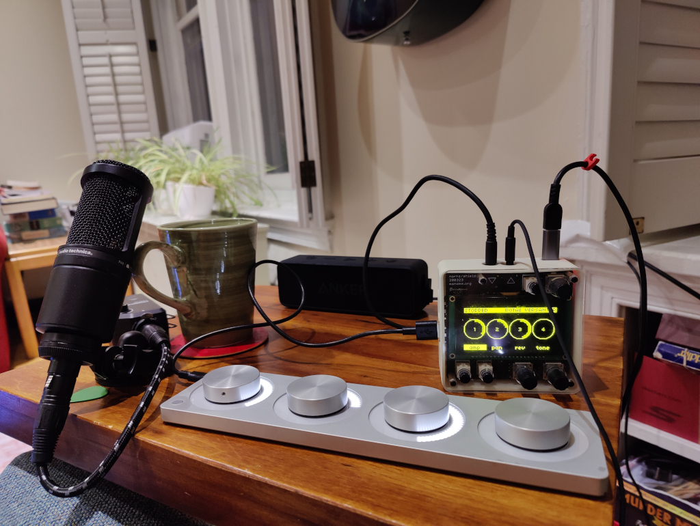

# Rotae Versantur

> The wheels turn

A four-track recorder. This is a Norns script and engine optimized for the Monome Arc, though with a bit more tweaks it could be used with only a Norns.

## General Concept

Each wheel (knob) on the Arc represents a track. The Arc button toggles between playing (or recording), stopping when pressed and released. If you press the button and turn a wheel you get further actions.

* Wheel = Apply the current mode (amp, pan, reverb, tone) to the track
* Button + Wheel 1 = Seek (all tracks are synced)
* Button + Wheel 2 = Change modes
* Button + Wheel 3 = Select track for recording
* Button + Wheel 4 = Select tracks for bouncing

## Workflow / Tutorial

All tracks start out empty

### Record to track 1
* Hold down the button and turn Wheel 3 to select track 1 for recording
* Press and release the button to start recording from your microphone
* Make some noise!
* Press and release the button to stop recording

### Record to track 2 while playing track 1
* Hold down the button and turn Wheel 3 to select track 2 for recording
* Press and release the button to start recording from your microphone
* You are now listening to Track 1 and recording to track 2
* Press and release the button to stop recording

### Play back and adjust
* Press and release the button to start playback
* Turn Wheel 1 and Wheel 2 to adjust amp (volume)
* Hold down the button and turn wheel 2 until reverb (wheel 3) is lit
* Turn Wheel 1 and Wheel 2 to adjust reverb
* Hold down the button and turn wheel 2 until amp (wheel 1) is lit
* Turn Wheel 1 and Wheel 2 to adjust amp (volume) a bit more
* Press and release the button to stop playback
* Hold the button and turn Wheel 1 to seek back to the beginning

### Combine track 1 and track 2 onto track 3
* Hold the button and turn Wheel 4 (bounce) until track 1 and track 2 are selected
* Hold the button and turn Wheel 3 (record) until track 3 is selected
* Hold the button and turn Wheel 1 (seek) until you are at the beginning
* Press and release the button to record
* The microphone AND track 1 AND track 2 will be recorded to track 3
* Press and release the button to stop recording
* Now you can record over track 1 and track 2

